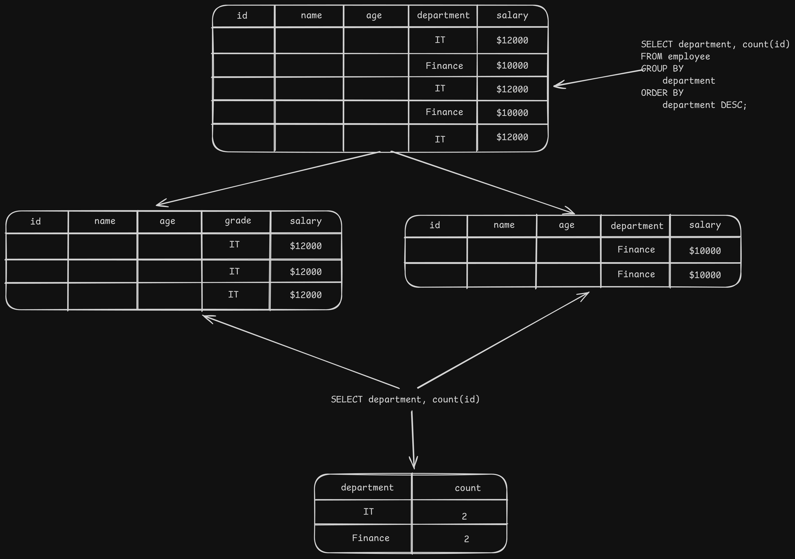

# Group Clauses

> In SQL, the `GROUP BY` clause is used to arrange identical data into groups. This is particularly useful when you want to aggregate data, such as calculating sums, averages, counts, etc., for each group.

- [Group Clauses](#group-clauses)
  - [Group by Clause](#group-by-clause)
  - [Syntax](#syntax)
  - [Example](#example)
  - [Having Clause](#having-clause)
  - [Grouping Sets, Rollup, and Cube](#grouping-sets-rollup-and-cube)
    - [1. GROUPING SETS](#1-grouping-sets)
  - [2. CUBE](#2-cube)
  - [3. ROLLUP](#3-rollup)

## Group by Clause

- Suppose we apply the `GROUP BY` clause to a column named `category` in a table called `products`.
- Data with the same category is grouped together based on unique category values. Aggregate functions are applied to each group, and the query returns one result row per group.
- The order of query execution is as follows:

  

- Following image illustrates how the `GROUP BY` clause works:

  

## Syntax

```sql
SELECT column1, aggregate_function(column2)
FROM table_name
WHERE condition
GROUP BY column1;
```

- `column1`: The column by which you want to group the results.
- `aggregate_function(column2)`: An aggregate function (like `SUM`, `COUNT`, `AVG`, etc.) applied to another column.
- `table_name`: The name of the table from which to retrieve data.
- `condition`: An optional condition to filter rows before grouping.
- `GROUP BY column1`: This clause groups the results based on the values in `column1`.

## Example

- Example 1: Grouping data by a single column

  ```sql
  SELECT department, COUNT(*)
  FROM employees
  GROUP BY department;
  ```

  - This query counts the number of employees in each department.

- Example 2: Grouping data by multiple columns

  ```sql
    SELECT department, job_title, AVG(salary)
    FROM employees
    GROUP BY department, job_title;
  ```

  - This query calculates the average salary for each combination of department and job title.

- Example 3: Using `HAVING` clause with `GROUP BY`

  ```sql
    SELECT department, COUNT(*)
    FROM employees
    GROUP BY department
    HAVING COUNT(*) > 5;
  ```

## Having Clause

- The `HAVING` clause is used to filter groups based on a specified condition, similar to how the `WHERE` clause filters rows.
- As we know it divides the records into groups based on one or more columns, at that groups level we can apply the `HAVING` clause to filter out groups that do not meet certain criteria.

- Example: Using `HAVING` clause to filter groups

  ```sql
  SELECT department, COUNT(*)
  FROM employees
  GROUP BY department
  HAVING COUNT(*) > 10;
  ```

  - This query counts the number of employees in each department and only returns those departments that have more than 10 employees.

- Example: Using `HAVING` with aggregate functions

  ```sql
  SELECT department, AVG(salary)
  FROM employees
  GROUP BY department
  HAVING AVG(salary) > 60000;
  ```

  - This query calculates the average salary for each department and only returns those departments where the average salary is greater than 60,000.

- Note: We can't use the column aliases defined in the `SELECT` clause, because `HAVING` is evaluated before `SELECT` in the SQL order of operations.

## Grouping Sets, Rollup, and Cube

### 1. GROUPING SETS

- Grouping Sets allow us to define multiple grouping queries in a single `GROUP BY` clause. This is useful when we want to generate multiple levels of aggregation in one query.
- `UNION ALL` can be used to combine the results of multiple `GROUP BY` queries, but `GROUPING SETS` provides a more concise way to achieve the same result.

- Example: Using `GROUPING SETS`

  ```sql
    SELECT
      brand,
      segment,
      SUM(sales) AS total_sales
    FROM
      sales_data
    GROUP BY
      GROUPING SETS (
        (brand, segment),
        (brand),
        (segment),
        ()
      );
  ```

  - `GROUPING SETS` in this example generates aggregations for:

    - Each combination of `brand` and `segment`
    - Each `brand` alone
    - Each `segment` alone
    - A grand total (no grouping columns)

  - The result will look something like this:

    | brand | segment | quantity |
    | :---- | :------ | :------- |
    | XYZ   | Basic   | 300      |
    | ABC   | Premium | 100      |
    | ABC   | Basic   | 200      |
    | XYZ   | Premium | 100      |
    | ABC   | `NULL`  | 300      |
    | XYZ   | `NULL`  | 400      |

- `GROUPING` Function is used to identify whether a column in the result set is aggregated or not. It returns `1` if the column is aggregated (i.e., it is part of a higher-level aggregation) and `0` if it is not.

  ```sql
    SELECT
      brand,
      segment,
      SUM(sales) AS total_sales,
      GROUPING(brand) AS is_brand_aggregated,
      GROUPING(segment) AS is_segment_aggregated
    FROM
      sales_data
    GROUP BY
      GROUPING SETS (
        (brand, segment),
        (brand),
        (segment),
        ()
      );
  ```

  - In this example, the `GROUPING` function helps to identify which rows correspond to aggregated data for `brand` and `segment`.

  - The result will look something like this:

    | brand  | segment | total_sales | is_brand_aggregated | is_segment_aggregated |
    | :----- | :------ | :---------- | :------------------ | :-------------------- |
    | XYZ    | Basic   | 300         | 0                   | 0                     |
    | ABC    | Premium | 100         | 0                   | 0                     |
    | ABC    | Basic   | 200         | 0                   | 0                     |
    | XYZ    | Premium | 100         | 0                   | 0                     |
    | ABC    | `NULL`  | 300         | 0                   | 1                     |
    | XYZ    | `NULL`  | 400         | 0                   | 1                     |
    | `NULL` | `NULL`  | 700         | 1                   | 1                     |

## 2. CUBE

- The `CUBE` operator is used to generate all possible combinations of aggregations for the specified columns and add it into the `GROUPING SETS`.
- It is particularly useful for generating multi-dimensional reports, as it provides a way to see data from various perspectives.

  - Example: Using `CUBE`

    ```sql
    GROUP BY
      CUBE (brand, segment);

    -- It will generate the same result as:
    <!--
    |
    |
    |
    ↓
    -->
    GROUP BY
      GROUPING SETS (
        (brand, segment),
        (brand),
        (segment),
        ()
      );
    ```

## 3. ROLLUP

- Unlike `CUBE`, which generates all possible combinations, the `ROLLUP` operator creates a hierarchical aggregation. It is used to generate subtotals that roll up from the most detailed level to a grand total.
- This is particularly useful for generating reports that require subtotals at various levels of a hierarchy.

  - Example: Using `ROLLUP`

    ```sql
    GROUP BY
      ROLLUP (brand, segment);

    -- It will generate the same result as:
    <!--
    |
    |
    |
    ↓
    -->
    GROUP BY
      GROUPING SETS (
        (brand, segment),
        (brand),
        ()
      );
    ```

  - Example: Using `ROLLUP` to generate count based on year > month > day

    ```sql
    SELECT
      EXTRACT(YEAR FROM rental_date) AS rental_year,
      EXTRACT(MONTH FROM rental_date) AS rental_month,
      EXTRACT(DAY FROM rental_date) AS rental_day,
      COUNT(*) AS rental_count
    FROM
      rentals
    GROUP BY
      ROLLUP (
        EXTRACT(YEAR FROM rental_date),
        EXTRACT(MONTH FROM rental_date),
        EXTRACT(DAY FROM rental_date)
      );
    ORDER BY
      rental_year,
      rental_month,
      rental_day;
    ```

    - This query will provide a count of orders at each level: daily, monthly, yearly, and a grand total.
